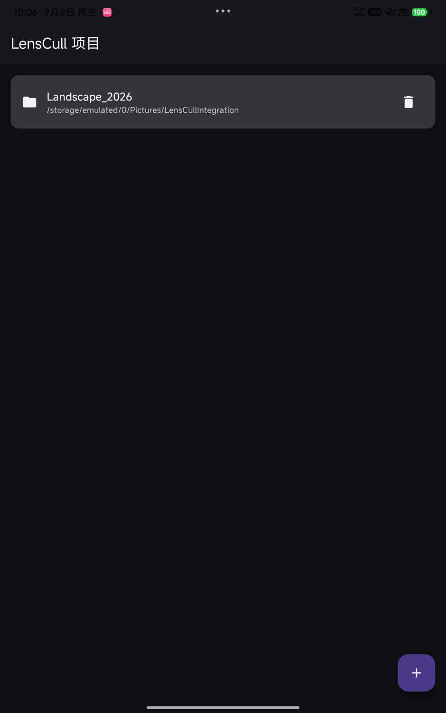
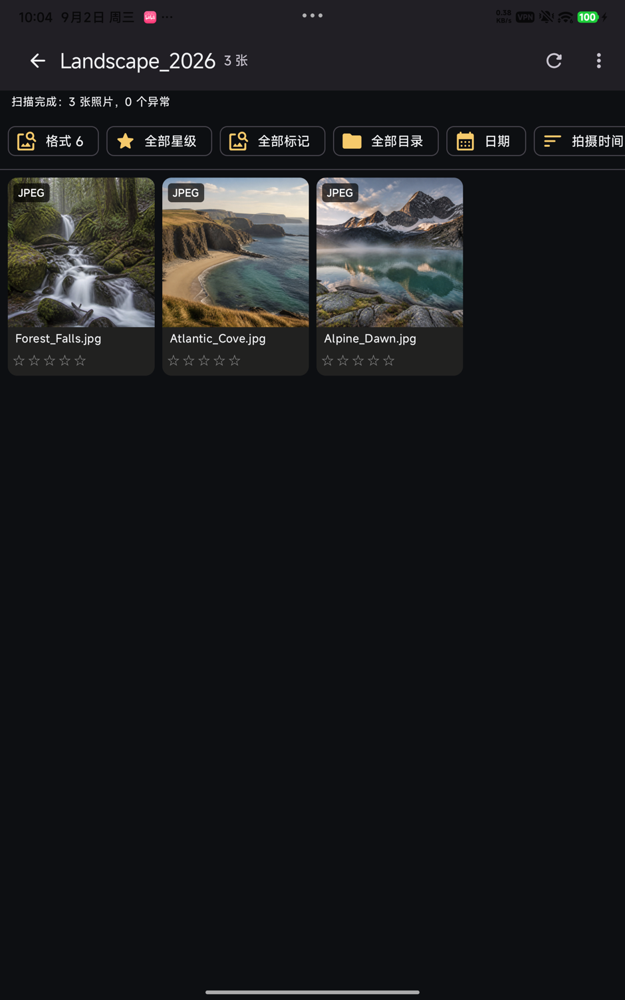
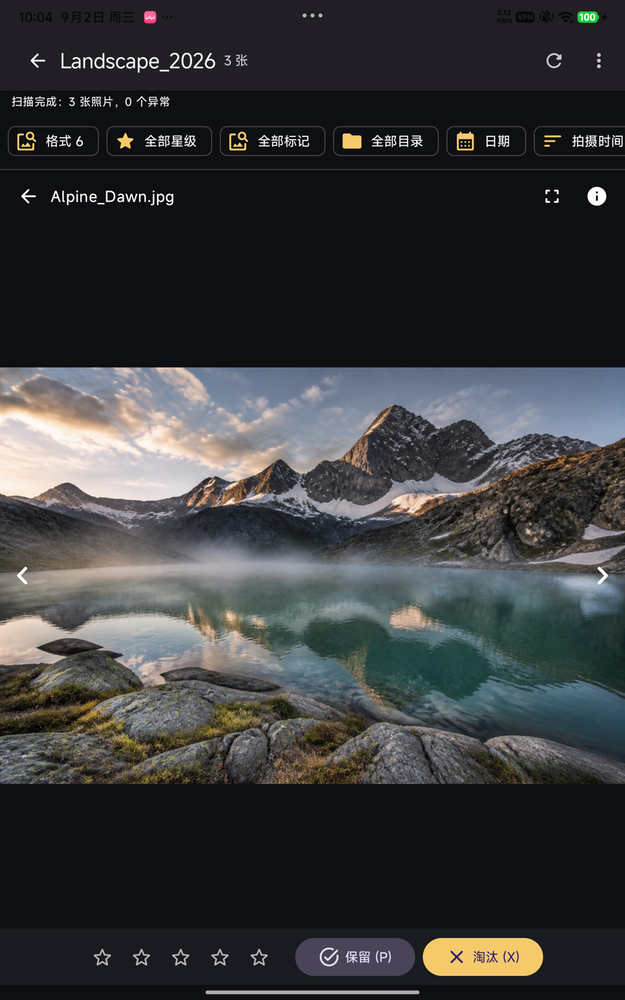
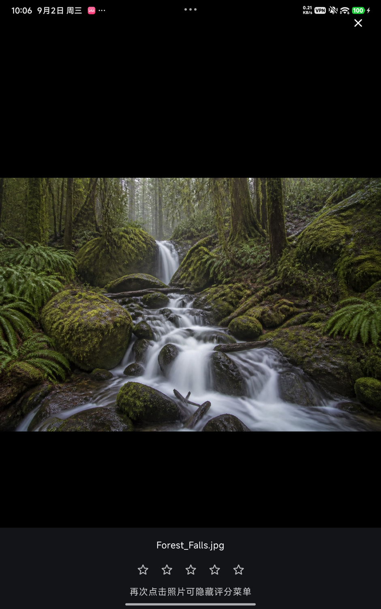
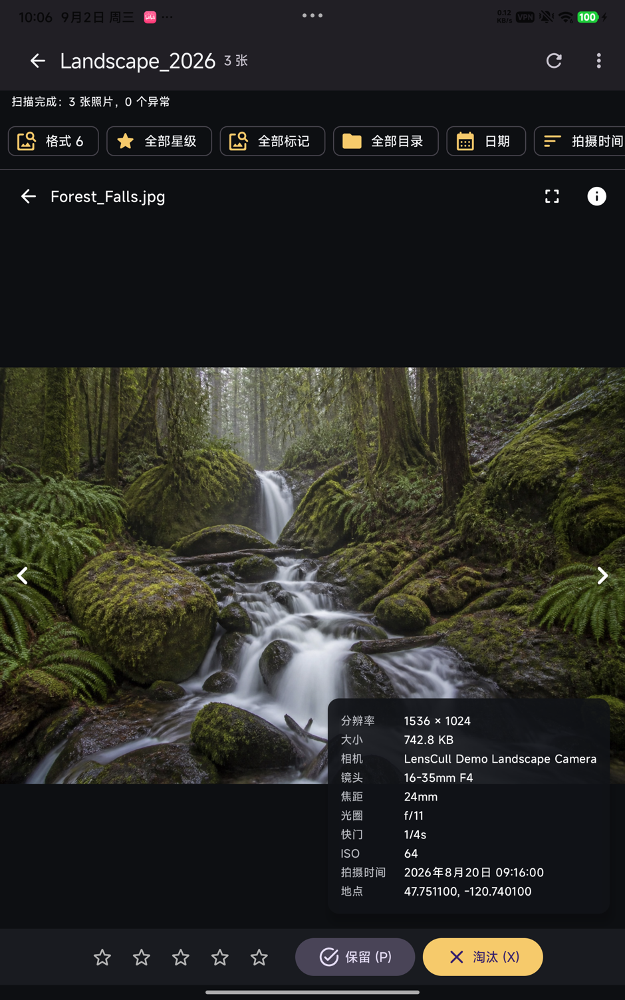

<p align="center">
  
</p>

<h1 align="center">LensCull</h1>

<p align="center">面向摄影师的离线 Android 选片工具：把一次拍摄作为项目，快速浏览、比较、筛选与评分。</p>

LensCull 直接扫描手机或平板上的本地照片，不上传云端。你可以为婚礼、旅行、商业拍摄等任务分别创建项目，绑定整个存储或指定目录，再用格式、星级、标记、目录与日期组合筛选。普通预览和全屏预览都支持像 ViewPager 一样跟手、无缝衔接的左右滑动，照片还可双指缩放。

## 界面预览

以下截图来自连接的 Android 真机，展示内容为带模拟 EXIF 的风景演示样片。

<table>
  <tr>
    <td width="50%"><br><sub>项目独立管理目录与选片结果</sub></td>
    <td width="50%"><br><sub>照片网格、组合筛选与快速星级</sub></td>
  </tr>
  <tr>
    <td><br><sub>普通预览也可跟手左右切换、缩放和评分</sub></td>
    <td><br><sub>全屏点按照片显示或隐藏评分菜单</sub></td>
  </tr>
  <tr>
    <td colspan="2" align="center"><br><sub>长按放大后的照片，在右下角快速查看关键 EXIF</sub></td>
  </tr>
</table>

## 主要能力

- 项目制工作流：先创建项目，再扫描全部存储或选择指定目录；删除项目不会删除原片。
- 摄影格式：JPEG/JPG、PNG、WebP、HEIC/HEIF、DNG 和 Panasonic RW2。
- 专业选片：0–5 星评分、保留/淘汰标记，以及格式、星级、标记、目录、日期组合筛选。
- 流畅审片：普通/全屏两种预览、跟手 ViewPager 式左右切换、双指缩放、快速上一张/下一张。
- EXIF 查看：分辨率、文件大小、相机、镜头、焦距、光圈、快门、ISO、拍摄时间与 GPS 地点。
- 离线与安全：不上传、不移动、不重命名照片；无账号、网络依赖或遥测。

RW2/DNG 使用内嵌 JPEG 进行快速预览，不在移动端执行 RAW 显影。JPEG/PNG/WebP 的评分写入 `xmp:Rating`；RW2/DNG 写入同名 `.xmp` sidecar；HEIC 评分保存在本地数据库。

## 开始使用

支持 Android 13（API 33）及以上。可从 [Releases](https://github.com/Stxr/lens-cull-android/releases) 下载 APK，或自行构建后侧载：

```bash
./gradlew assembleDebug
adb install -r app/build/outputs/apk/debug/app-debug.apk
```

首次启动后，请按引导授予“管理所有文件”权限；LensCull 需要它来扫描设备中的照片。应用不会删除原片。

## 开发与验证

项目使用 Kotlin、Jetpack Compose、Room、Paging、WorkManager、Coil 与 ZoomImage，编译环境为 JDK 17 / Android SDK 36。

```bash
./gradlew testDebugUnitTest
./gradlew lintDebug assembleDebug
./gradlew connectedDebugAndroidTest
```

已在 Pixel Tablet API 33/36 环境与 1880 × 3008 Android 真机上验证。设备测试覆盖项目创建、指定目录扫描、数据库迁移、分页手势、全屏评分，以及 JPEG/PNG/WebP 的 XMP 评分写入与回读。

仓库内的 `docs/assets/sample-photos` 提供三张带模拟相机、镜头、曝光、时间和 GPS EXIF 的演示样片，便于本地验证完整信息面板。

## 快捷键

- `0`–`5`：清除/设置星级
- `P`：保留
- `X`：淘汰
- `←` / `→`：上一张/下一张

完整设计见 [`docs/superpowers/specs/2026-08-30-lenscull-design.md`](docs/superpowers/specs/2026-08-30-lenscull-design.md)。
